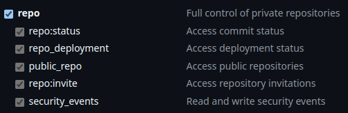
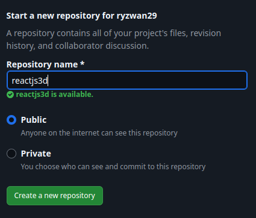
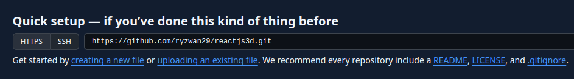

# ARLink
Register here [https://arlink.arweave.net/](https://arlink.arweave.net/)

# Prerequisite
- GitHub Account
- VPS (Optional)
- [ArConnect Walllet](https://www.arconnect.io/)
- Buy some AR from Exchange then withdrawl to your wallet address
- [Bridge AR > wAR](https://aox.xyz/#/beta)
- [Swap wAR > tARIO](https://permaswap.arweave.dev/#/ao/WAR-TARIO?tab=swap)
- Domain ArNS, [you can buy Domain ArNS here](https://arns.app/#/?search=)

# Start
## Get your GitHub auth Token
- Go to setting > Developer setting > Personal Access Token > Token Classic > Generate New Token (Classic)

Then save your Github Auth Token

## Create your Github Repository
- From github dashboard click "Create a new repository"

- Then save your remote address
